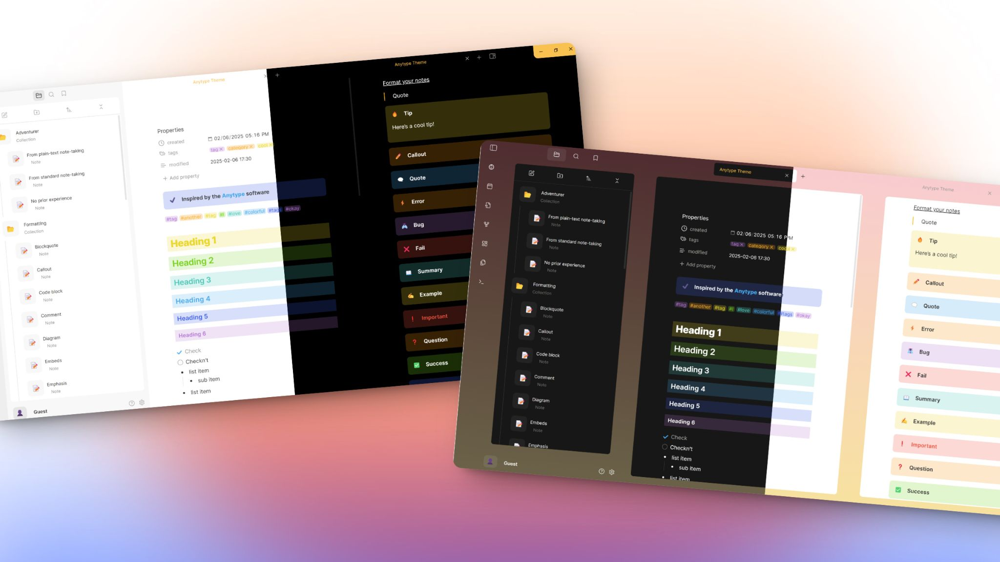

# Anytype 
A simple theme based on **Anytype** note-taking software. 

## Features
> Note: requires Style Settings plugin

- [x] Set a beautiful **gradient background** for your workspace.
- [x] Toggle **OLED dark mode**.
- [x] Change **heading styles** to be more or less colorful!
- [x] Change your **"username"** and **"icon"** (shows in eettings and below the file explorer) 

# Credits
- Creators of *Anytype*, for making such a beautiful and inspirational app!
- All of you theme developers for inspiring me to also make themes! 😁
